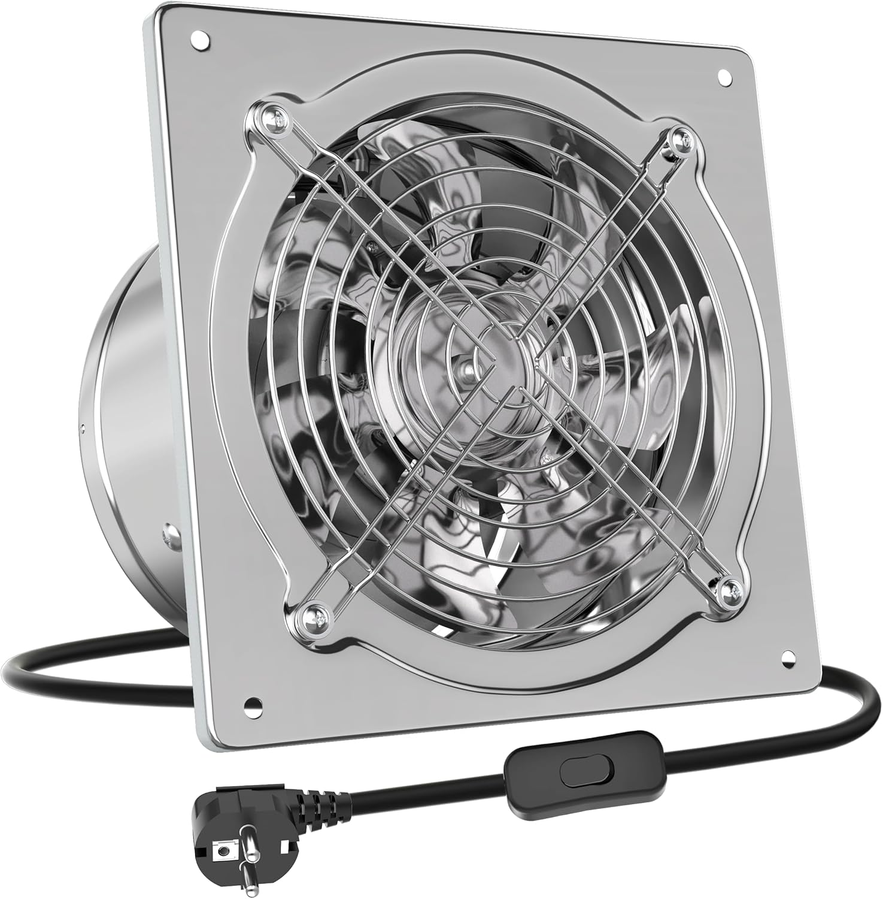

# arduino_fanController

## An Arduino based fan controller for wet environments

Based on [Adafruit's DHT library](https://github.com/Khuuxuanngoc/DHT-sensor-library)

## ToDo:

- [x] Get requirement
- [x] Find a good idea
- [ ] Find all hardware stuff
- [ ] Write code
- [ ] Debug
- [ ] Install in a real environment
- [ ] Write a meaningful documentation